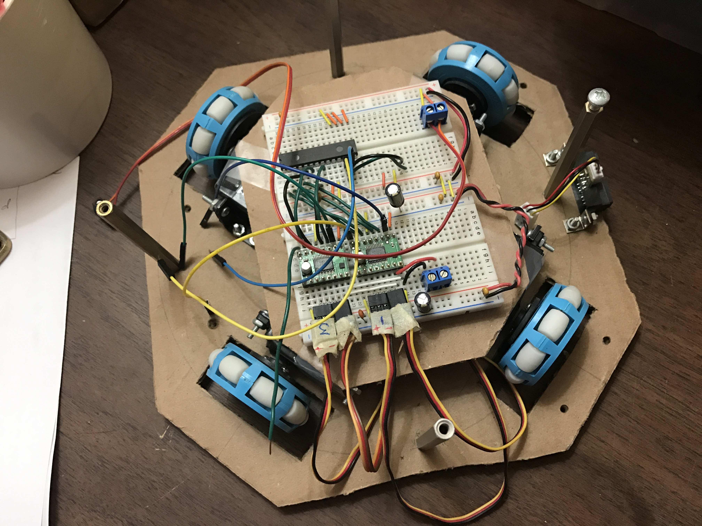
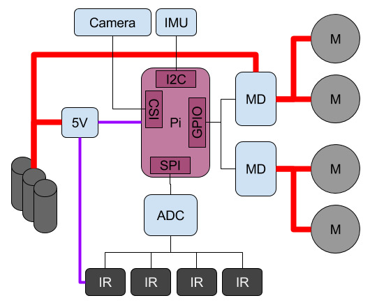

# Soccer

My robot has seen better days and is currently torn appart. However, I plan to rebuild
it. Right now I am re-working it and put it into a like "bread board" configuration so
I can get everything setup again correctly.

## Documentation

- main battery is a 12V NiMH with a Pololu 5v, 2.6A buck converter supplying power to both RPi and the IR sensors. 
- the Pi is used to provide 3.3V to the IMU. 
- a MCP3208 ADC (8 channel, 12b) is used to read the IR sensors.
- 4 geared DC brushed motors (138 rmp @ 12V) drive the robot
- Omni wheels from www.kornylak.com allow non-holonomic movement
- Raspberry Pi Camera
- NXP IMU from Adafruit

### Other Docs

- [Markdown docs](./docs/Markdown)
- [Jupyter notebooks](./docs/ipython)

# Licenses

**Note:** The software, hardware, and documentation are under different licenses.

## Software

**The MIT License (MIT)**

Copyright (c) 2016 Kevin J. Walchko

Permission is hereby granted, free of charge, to any person obtaining a copy of
this software and associated documentation files (the "Software"), to deal in
the Software without restriction, including without limitation the rights to
use, copy, modify, merge, publish, distribute, sublicense, and/or sell copies
of the Software, and to permit persons to whom the Software is furnished to do
so, subject to the following conditions:

The above copyright notice and this permission notice shall be included in all
copies or substantial portions of the Software.

THE SOFTWARE IS PROVIDED "AS IS", WITHOUT WARRANTY OF ANY KIND, EXPRESS OR
IMPLIED, INCLUDING BUT NOT LIMITED TO THE WARRANTIES OF MERCHANTABILITY, FITNESS
FOR A PARTICULAR PURPOSE AND NONINFRINGEMENT. IN NO EVENT SHALL THE AUTHORS OR
COPYRIGHT HOLDERS BE LIABLE FOR ANY CLAIM, DAMAGES OR OTHER LIABILITY, WHETHER
IN AN ACTION OF CONTRACT, TORT OR OTHERWISE, ARISING FROM, OUT OF OR IN
CONNECTION WITH THE SOFTWARE OR THE USE OR OTHER DEALINGS IN THE SOFTWARE.

## Hardware and Documentation

 This work is licensed under a <a rel="license" href="http://creativecommons.org/licenses/by-sa/4.0/">Creative Commons Attribution-ShareAlike 4.0 International License</a>.
