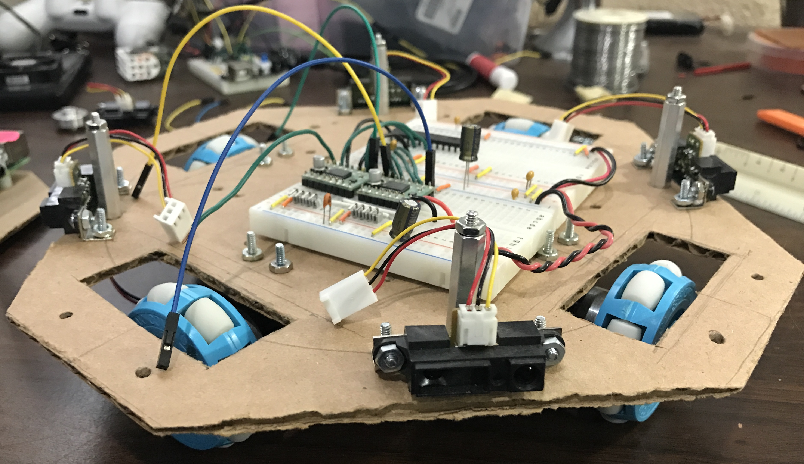

# Soccer

My robot has seen better days and is currently torn appart. However, I plan to rebuild
it. Right now I am re-working it and put it into a like "bread board" configuration so
I can get everything setup again correctly.

## Hardware

### Raspberry Pi

I am currently using a 1.2 GHz quad core [RPi 3](https://www.adafruit.com/products/3055) (ARMv8) as the main board running the lite version of Raspbian. It has on-board:

* 802.11n Wifi 
* Bluetooth 4.1 BLE

### Camera Interface (CSI)

* [PiCamera](https://www.adafruit.com/products/3099) is used for video odometry (currently have version 1, 5 Mpixels but moving to 8 Mpixels)

### USB

* A [Logitech c270 camera](http://www.logitech.com/en-us/product/hd-webcam-c270) provides video and microphone capabilities

### I2C

The following is on the I2C bus:

* [MCP23017 16b I/O Expander](https://www.adafruit.com/products/732): 0x20
* Adafruit [BNO055 AHRS](https://www.adafruit.com/products/2472): 0x28
* Adafruit [8x8 LED Matrix](https://www.adafruit.com/products/1052): 0x70 

### Sensors

* [Sharp GP2Y0A21YK0F IR](https://www.adafruit.com/products/164) sensors give 10-80 cm (3.9-31.5 in)
* Pololu [ACS711LC Current sensor](https://www.pololu.com/product/2198) measures up to +/-25 A and up to 30 V

### Motion

* Pololu [TB6612FNG Dual Motor Driver](https://www.pololu.com/product/713) provides 4.5-13.5V at 1A continuous (3A peak) current.
* Motors currently are hacked servos, but moving to 12V 130 rpm gear motors

## Cost

Here is a parts list of **key components** that I am using. I am not listing wires, bread boards, cables, etc. Also note, I have rounded up the costs (i.e., $4.95 => $5).

| Part | Source | Number | Item Cost | Sum | Notes |
| ---  | ---    | ---    | ---       | --- | ---   |
| RPi v3    | [Adafruit](https://www.adafruit.com) | 1 | $40 | $40 | Main board, has wifi and bluetooth already |
| Pi Camera | [Adafruit](https://www.adafruit.com) | 1 | $30 | $30 | Currently have old 5 Mpixel, will upgrade to newer 8 Mpixel |
| 9-DOF IMU (BNO055) | [Adafruit](https://www.adafruit.com) | 1 | $35 | $35 | It is an AHRS, works over I2C |
| PWM/Servo Driver, 16 Channels, 12 bit resolution (PCA9685) | [Adafruit](https://www.adafruit.com) | 1 | $15 | $15 | Controls motors and servos over I2C |
| MCP23017 (16 I/O port expander, I2C) | [Adafruit](https://www.adafruit.com) | 1 | $3 | $3 | Used to increase the digital I/O |
| Standard Servo Motor | [Adafruit](https://www.adafruit.com) | 4 | $12 | $48 | Hacked for continuous turning |
| TB6612FNG Dual Motor Driver | [Pololu](https://www.pololu.com) | 2 | $5 | $10 | Logic level 3.3V, motors 4.5-13V @ 1A continous (3A peak) per channel |
| 5V, 5A Buck Converter (D24V50F5)  | [Adafruit](https://www.adafruit.com) | 4 | $15 | $15 | For powering my electronics |
| 12V, 5A Boost Converter (U3V50F12) | [Adafruit](https://www.adafruit.com) | 4 | $14 | $14 | For powering my motors (future 12V motors) |
| Sharp IR | [Pololu](https://www.pololu.com) | 8 | $10 | $80 | Range 10-80 cm |
| PS4 Controller   | [Walmart](http://www.walmart.com) | 1 | $54 | $54 | |
| Micro SD (32 GB) | [Walmart](http://www.walmart.com) | 1 | $12 | $12 | |
| Logitech C270 | [Walmart](http://www.walmart.com) | 1 | $30 | $30 | Connected via USB, also use the on board microphone |

## SSH Login Art

You can create ascii art from jpegs or text with the programs:

    jp2a --background=light -i --output='art.txt' <some_file.jpg>
    figlet 'hello world'

Use `brew` to install::

	brew install jp2a

# Licenses

**Note:** The software, hardware, and documentation are under different licenses.

## Software

**The MIT License (MIT)**

Copyright (c) 2016 Kevin J. Walchko

Permission is hereby granted, free of charge, to any person obtaining a copy of
this software and associated documentation files (the "Software"), to deal in
the Software without restriction, including without limitation the rights to
use, copy, modify, merge, publish, distribute, sublicense, and/or sell copies
of the Software, and to permit persons to whom the Software is furnished to do
so, subject to the following conditions:

The above copyright notice and this permission notice shall be included in all
copies or substantial portions of the Software.

THE SOFTWARE IS PROVIDED "AS IS", WITHOUT WARRANTY OF ANY KIND, EXPRESS OR
IMPLIED, INCLUDING BUT NOT LIMITED TO THE WARRANTIES OF MERCHANTABILITY, FITNESS
FOR A PARTICULAR PURPOSE AND NONINFRINGEMENT. IN NO EVENT SHALL THE AUTHORS OR
COPYRIGHT HOLDERS BE LIABLE FOR ANY CLAIM, DAMAGES OR OTHER LIABILITY, WHETHER
IN AN ACTION OF CONTRACT, TORT OR OTHERWISE, ARISING FROM, OUT OF OR IN
CONNECTION WITH THE SOFTWARE OR THE USE OR OTHER DEALINGS IN THE SOFTWARE.

## Hardware and Documentation

 This work is licensed under a <a rel="license" href="http://creativecommons.org/licenses/by-sa/4.0/">Creative Commons Attribution-ShareAlike 4.0 International License</a>.
