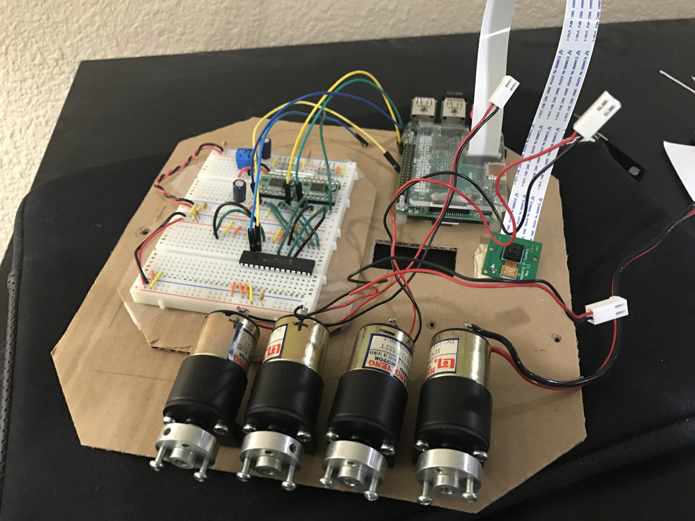

# History

Long ago, I hacked some old servos to make them continue turn and used them
to drive this robot. They worked okay, but I wanted to replace them with some
good DC motors.

This was a simple breadboard I setup to test out my new DC motors that replaced
the old hacked servos.

