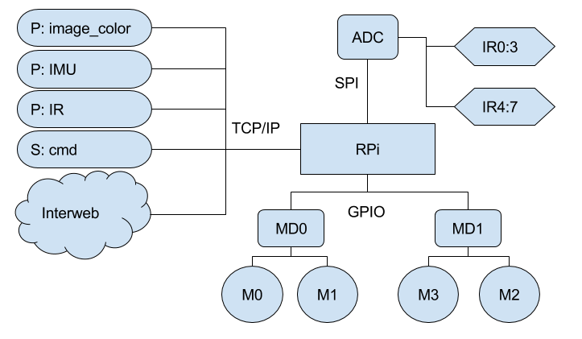

# Documentation

- [Software](./software.md)
- [Hardware](./hardware.md)
- [PyGecko](./pygecko.md)
- [History](./history.md)

---

A highlevel overview of how the robot works is shown below

- P: publish pygecko messages
- S: subscribe to pygecko messages

The publish and subscribe architecture is drawn from ROS ([Robotic Operating System](http://www.ros.org/)) where multiple/modular processess run a robot and
they communicate via a publish/subscribe architecture. I don't use ROS because
it is a pain to install on systems it is not designed for. I use [PyGecko](https://github.com/walchko/pygecko) which implements some of the basic
useful features of ROS.

A **nonholonomic system** in physics and mathematics is a system whose state
depends on the path taken in order to achieve it. [Ref](https://en.wikipedia.org/wiki/Nonholonomic_system)
Think about how a car (nonholonomic) must parallel park ... wouldn't it be easier
if it could drive sideways! Basically, a car has a velocity constraint in its
movement.

Since this robot can move in any direction and is not required to follow a specific
path, it is a **holonomic system** and is a common design in robotic soccer.

---

	
	 This work is licensed under a <a rel="license" href="http://creativecommons.org/licenses/by-sa/4.0/">Creative Commons Attribution-ShareAlike 4.0 International License</a>.

